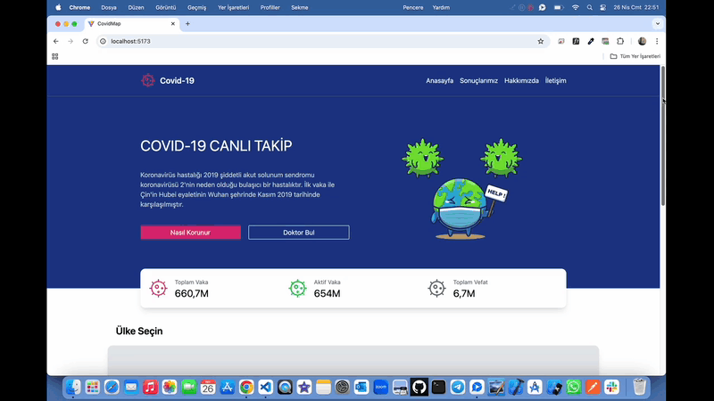

# CovidMap Testing 🦠

<li>Bu proje Covid-19 virüsünün yarattığı sonuçlarının gösterildiği tüm ülkeleri kapsayan dünya haritadır.</li>
<li>Her ülke için vaka,ölüm verilerine harita üzerinden detay sayfasından erişebilirsiniz.</li>

# Kullanılan Teknolojiler 🎨

<li>⭐ React</li>
<li>⭐ Vite</li>
<li>⭐ React-Router-Dom</li>
<li>⭐ React-Redux</li>
<li>⭐ Reduxjs-Toolkit</li>
<li>⭐ React-İcons</li>
<li>⭐ Tailwindcss</li>
<li>⭐ React-Simple-Maps</li>
<li>⭐ Millify</li>
<li>⭐ Axios</li>
<li>⭐ React-Testing-Library</li>

# Ekran Görüntüsü 🎥
    

# İletişim 📩
yunusemreoral@hotmail.com.tr
